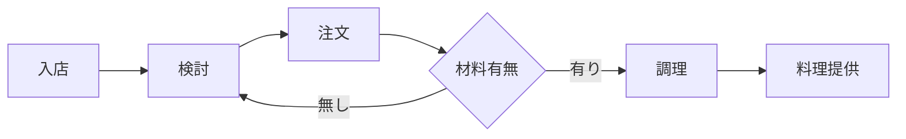
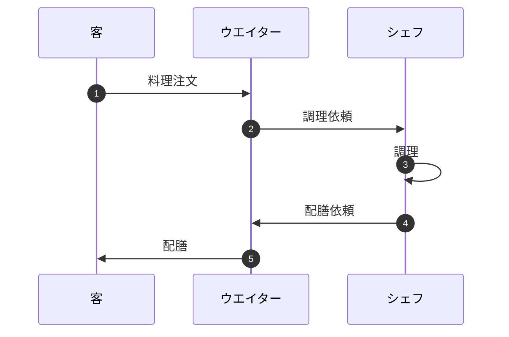

## Mermaidで記述できるダイアグラム
Mermaid記法で記述できるダイアグラムは以下の通りです。
- フローチャート
- シーケンス図
- ガントチャート
- クラス図
- Gitグラフ
- ER図
- ユーザージャーニー図
- ステータス図
- 円グラフ
- 要件図


かなり描けますよね！

このように、Mermaid記法を使うことで、NotePMの中でチャートやグラフを特別なソフトウェアなしに描くことができます。

テキストだけでなく、チャートを使うことで、より具体的に伝えられるようになったり、情報共有しやすくなるでしょう。

では、いくつか簡単な記述例を挙げていきます。


## フローチャートの例 

-構文-

```
graph LR;
            enter[入店];
            consider[検討];
            order[注文];
            confirm{材料有無};
            cook[調理];
            serve[料理提供];
            enter --> consider;
            consider --> order;
            order --> confirm;
            confirm -- 無し --> consider;
            confirm -- 有り --> cook;
            cook --> serve;
```
-このコードからなる図式-



## シーケンス図の例

-構文-

```
sequenceDiagram
autonumber
            participant guest as 客
            participant waiter as ウエイター
            participant sheff as シェフ
            guest ->> waiter: 料理注文
            waiter ->> sheff: 調理依頼
            sheff ->> sheff: 調理
            sheff ->> waiter: 配膳依頼
            waiter ->> guest: 配膳
```

-このコードからなる図式-



## 円グラフの例

-構文-

 ```
        pie title 売上割合
                "餃子" : 10
                "ビール" : 15
                "天津飯" : 15
                "青椒肉絲" : 20
                "餃子" : 20
                "チャーハン" : 20
```

-このコードからなる図式-

 ```mermaid
        pie title 売上割合
                "餃子" : 10
                "ビール" : 15
                "天津飯" : 15
                "青椒肉絲" : 20
                "餃子" : 20
                "チャーハン" : 20
```

今回は3つの記述例を挙げてみました。その他のダイアグラムで表す時の記述例は、以下のURLに飛んでご確認ください↓

[VSCodeでMermaidを使ったダイアグラム作成(記述例付き)](https://notepm.jp/help/mermaid)