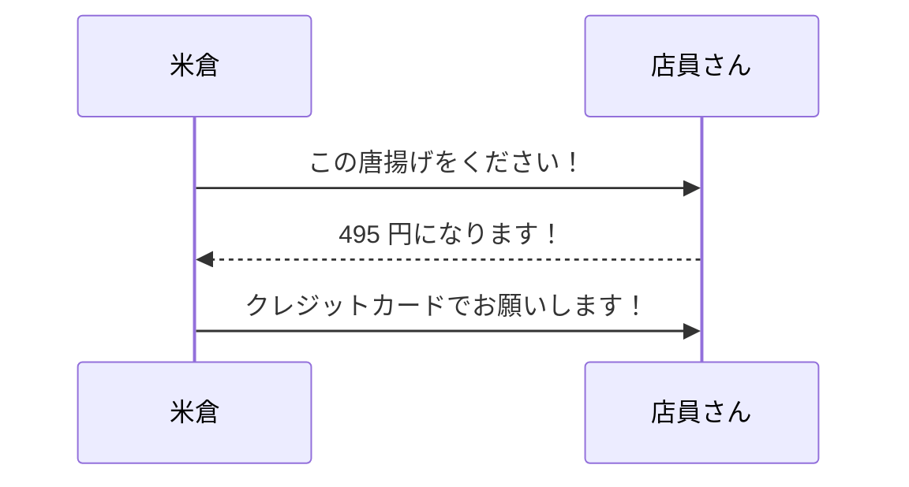

## チュートリアル

1 ... 欲しい商品を店員に言う。

2 ... 値段を言われる。

3 ... 支払方法を言う。
 
-図-

```mermaid
sequenceDiagram
  participant 米倉
  participant 店員さん
	
  米倉->>店員さん: この唐揚げをください！
  店員さん-->>米倉:　495 円になります！
  米倉->>店員さん: クレジットカードでお願いします！
```