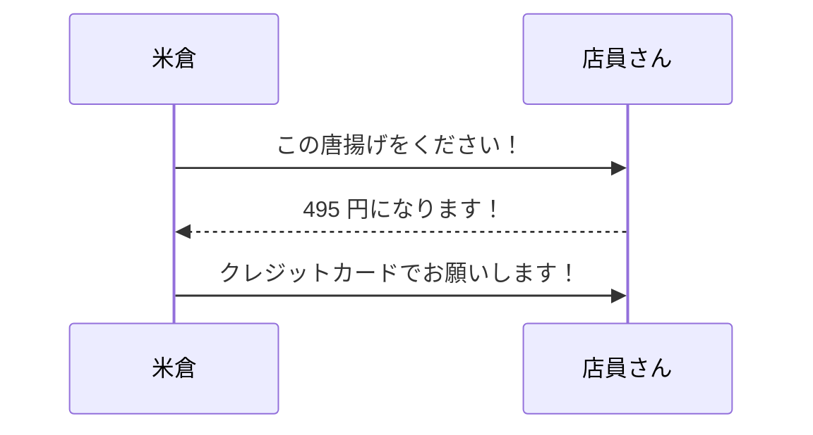

## チュートリアル

-説明-

下に記載されている図は"シーケンス図"というものです。
シーケンス図とは「プログラムの処理の流れや概要」を設計する際に使われます。オブジェクト指向のソフトウェア設計においては、グローバルスタンダードの設計手法と言っても過言ではありません。

プログラムの処理の流れや概要について、具体的には「クラスやオブジェクト間のやり取り」を「時間軸に沿って」、図で表現します。UMLの中では「相互作用図」の1つに位置付けられています。

なお、シーケンス図はシステム設計時のみならず設計書の無い既存システムの分析（リバースエンジニアリング）にも使われることがあります。
 
-図-
